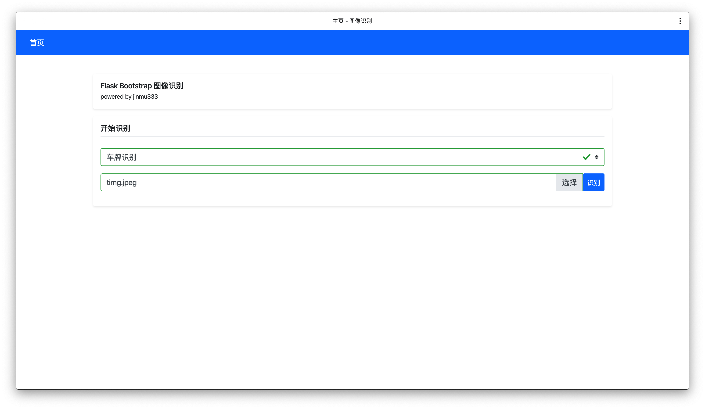
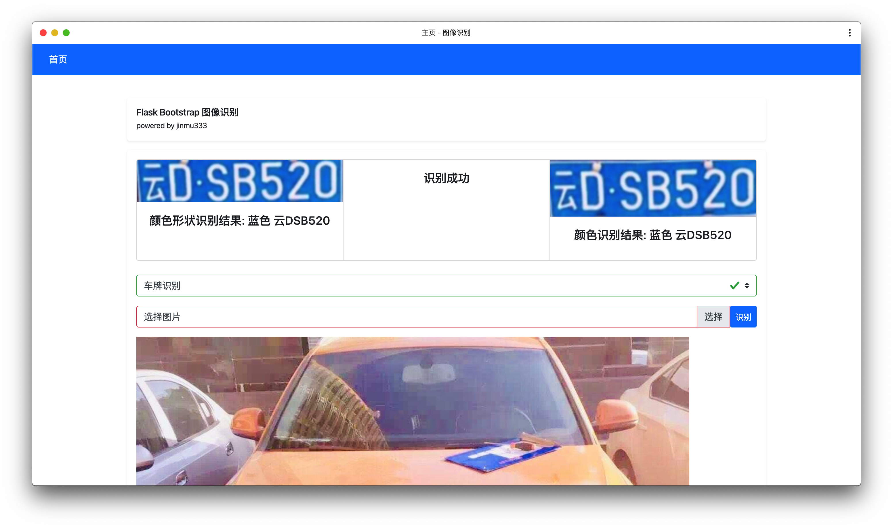

# Python Flask Bootstrap opencv 车牌识别

[   ](https://github.com/jinmu333/python_PlateRecogntion)
[](https://github.com/996icu/996.ICU)

## 简介





* Flask Bootstrap 网页实现
* 毕业设计基于Opencv的车牌识别系统
* 安装 python3

## [原理简介](doc/doc.md)

## docker 依赖安装

安装docker

```bash
cd docker
bash start.sh build
bash start.sh
```

打开 [localhost:9999](http://localhost:9999)

## 本机依赖安装

```bash
# Installing ZBar for Ubuntu can be accomplished with the following command:
# An OpenCV barcode and QR code scanner with ZBar
sudo apt-get install libzbar0
```

```bash
# Installing ZBar for macOS
# Installing ZBar for macOS using brew is equally as easy (assuming you have Homebrew installed):
brew install zbar
```

```bash
python3 -m pip install -r requirements.txt
```

## 运行

```bash
# 运行
python3 start
```
